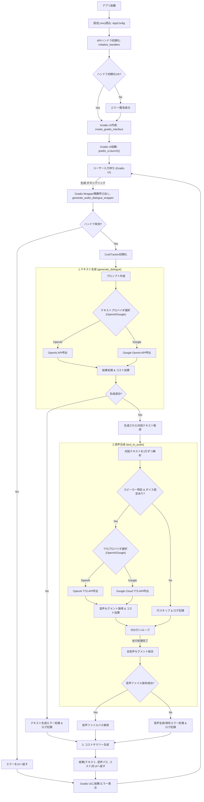

```mermaid
flowchart TD
    A[アプリ起動] --> B["設定(.env)読込: AppConfig"];
    B --> C["APIハンドラ初期化: initialize_handlers"];
    C --> D{ハンドラ初期化OK?};
    D -- Yes --> E["Gradio UI作成: create_gradio_interface"];
    D -- No --> F["エラー/警告表示"];
    F --> E;
    E --> G["Gradio UI起動: gradio_ui.launch()"];

    G --> H["ユーザー入力待ち (Gradio UI)"];
    H -- "生成" ボタンクリック --> I["Gradio Wrapper関数呼び出し: generate_audio_dialogue_wrapper"];

    I --> J{ハンドラ有効?};
    J -- No --> K["エラーをUIへ返す"];
    J -- Yes --> L["CostTracker初期化"];

    L --> M(1. テキスト生成処理);
    subgraph M ["1.テキスト生成 (generate_dialogue)"]
        M1["プロンプト作成"] --> M2{"テキストプロバイダ選択 (OpenAI/Google)"};
        M2 -- OpenAI --> M3["OpenAI API呼出"];
        M2 -- Google --> M4["Google Gemini API呼出"];
        M3 --> M5["結果処理 & コスト加算"];
        M4 --> M5;
        M5 --> M6{生成成功?};
    end

    M6 -- No --> N["テキスト生成エラー処理 & ログ記録"];
    M6 -- Yes --> O["生成された対話テキスト取得"];

    O --> P(2.音声合成処理);
    subgraph P ["2.音声合成 (text_to_audio)"]
        P1["対話テキストを1行ずつ解析"] --> P2{スピーカー特定 & ボイス設定あり?};
        P2 -- Yes --> P3{"TTSプロバイダ選択 (OpenAI/Google)"};
        P3 -- OpenAI --> P4["OpenAI TTS API呼出"];
        P3 -- Google --> P5["Google Cloud TTS API呼出"];
        P4 --> P6["音声セグメント取得 & コスト加算"];
        P5 --> P6;
        P6 --> P7["次の行へ/ループ"];
        P2 -- No --> P8["行スキップ & ログ記録"];
        P8 --> P7;
        P7 -- 全行処理完了 --> P9["全音声セグメント結合"];
        P9 --> P10{音声ファイル保存成功?};
    end

    P10 -- Yes --> Q["音声ファイルパス取得"];
    P10 -- No --> R["音声生成/保存エラー処理 & ログ記録"];

    N --> S["3. コストサマリー生成"];
    Q --> S;
    R --> S;

    S --> T["結果(テキスト, 音声パス, コスト)をUIへ返す"];
    K --> U["Gradio UIに結果/エラー表示"];
    T --> U;
    U --> H;
```
